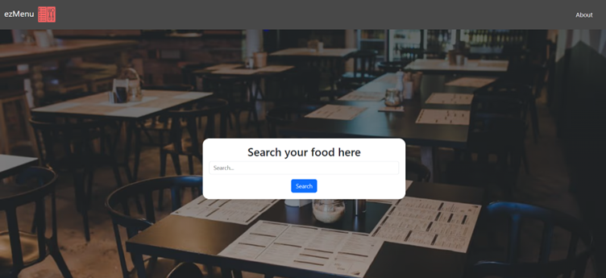

<!-- @format -->

<h1 align="center"> ezMenu </h1>



## ¿En qué consiste este proyecto?

Vamos a realizar una aplicación para la asignatura de Integración de Sistemas Informáticos, consistirá en una aplicación web que facilite al mundo de la hostelería a realizar una carta/menú digital sobre las comidas o bebidas que ofrecen y posteriormente el QR de ese menu para obtenerlo y ponerlo en las mesas.

## Construido con 🛠️

_Herramientas tecnológicas utilizadas para crear el proyecto:_

- [Git](https://git-scm.com/downloads) - Para el control de versiones
- [Python](https://www.python.org/downloads/) - Manejador de backend
- [Flask](https://flask.palletsprojects.com/en/3.0.x/installation/) - Framework para el frontend
- [Docker](https://docs.docker.com/get-docker/) - Para crear el contenedor

### Pre-requisitos 📋

_Descargar el proyecto utilizando:_

```
git clone https://github.com/gonzalodlr/isi-ezMenu.git
```

_Descargar las tecnologías necesarias con las que se construyó el proyecto [Tecnologías](#construido-con-️)_

_Registrarse en la siguiente página para utilizar las APIs:_

```
https://rapidapi.com/
```

_Subcribirse a las siguientes APIs_

```
https://rapidapi.com/apidojo/api/tasty
https://rapidapi.com/hydrone/api/qr-code-generator20
```

### Instalación 🔧

_Una vez se han realizado los [Pre-requisitos](#pre-requisitos-)_

_Crear un archivo .env en la carpera raíz del proyecto y agregar:_

```
API_KEY=”introduce_aquí_tu_api_key”
```

### Contenedor 📦

_Para crear el contenedor se facilita un archivo dockerfile_

```
docker build -f dockerfile -t ez-menu:latest .
```

## Contribuyendo 🖇️

Si quiere contribuir, contacte conmigo.

## Wiki 📖

Puedes encontrar una guía más detallada en: [Wiki](https://github.com/gonzalodlr/isi-ezMenu/blob/main/doc/Documentacion.pdf)

## Autores ✒️

_Creadores de este proyecto_

- **Gonzalo De Los Reyes Sánchez**
- **José Javier Bogado Candia**

## Licencia 📄

Este proyecto todavía no tiene Licencia debido a que sigue en construcción. Habría que consultar licencias y términos con las APIs utilizadas.

## Features 🎁

- Interfaz Responsive
- Mejorar la distribución y elementos del menú pdf generado
- Encontrar APIs que tengan más recetas y comidas
- SEO
- Bases de datos de clientes y lógica de usuarios
- Funciones premium
- Publicar
